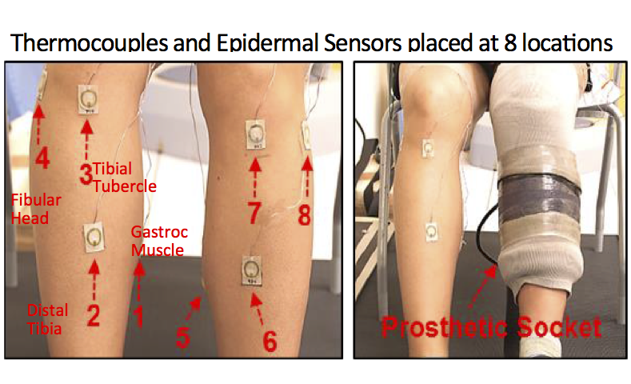

# SensorClassification
Simple BLSTM-MLP for sensor data classification

Files:
Temperature_Analysis_using_Theano.html **Printout of notebook, showing graphics, figures and results**
Temperature_Analysis_using_Theano.pynb **Python notebook with complete code**
Temperature_Analysis_using_Theano.py  **Python file conversion from python notebook**

Note: Data not added due to proprietary restrictions.

# Prosthetic Sensor Temperature Analysis

About the data:
Thermocouples and epidermal sensors were placed at 8 location (see Fig. 1). Data contains 8 feature rows and a class label. 

Important Notes:
- Sensor data is inherently noisy, as such, using a denoising autoencoder (dA) might be necessary. dA uses input $x \in [0,1]^d$ and maps it to $ y \in [0,1]^d$, uing a deterministic mapping often levered by a sigmoid function ($s$): $y=s(Wx+b)$ 
- Here, we will employ bidirectional LSTM (BLSTM), which are capable of learning the context in both temporal directions, in addition to a multi-layer perceptron (MLP), stacked (Model 1)
- **Future Implementation**: Auxiliary Classifier Generative Adversarial Network (ACGAN) is also shown in Model 2
- As evaluation metrics we used F-measure in order to compare the results with previous works.
 
Fig. 1 Sensor Placement

[MCH]
